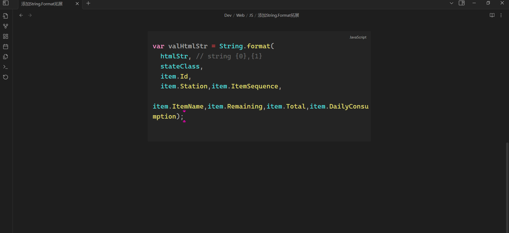
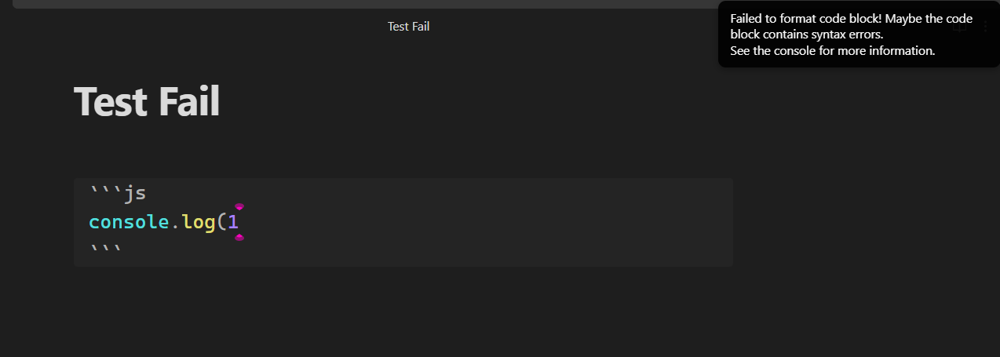

# Simple Code Formatter

Format the block of code where the cursor is located

# Direction for use

- Place the cursor in the block of code you want to format.
- Search "Simple Code Formatter" in `Command Palette`.
  
- Execute it.

# Example

# Supported Languges

| Language   | Formatter(JS Module) |
| ---------- | -------------------- |
| C          | js-beautify          |
| csharp     | js-beautify          |
| java       | prettier             |
| xml        | xml-formatter        |
| sql        | sqlformatter         |
| html       | prettier             |
| vue        | prettier             |
| css        | prettier             |
| javascript | prettier             |
| typescript | prettier             |
| json5      | prettier             |
| scss       | prettier             |
| less       | prettier             |
| graphql    | prettier             |
| markdown   | prettier             |
| yaml       | prettier             |

# Questions

## 1. Markdown syntax of the code block

Make sure the Markdown syntax of the code block you want to format is correct.

## 2. Code syntax in a code block

The plugin will check your code syntax which use `prettier` of `Formatter(JS Module)`.

### Example of Code syntax

## 3. If your code doesn't conform to syntax, but you still want to beautify it?

You should bypass the syntax check. You can use a language powered by `js-beautiby` instead of the current language.

After formatting, change it back.
